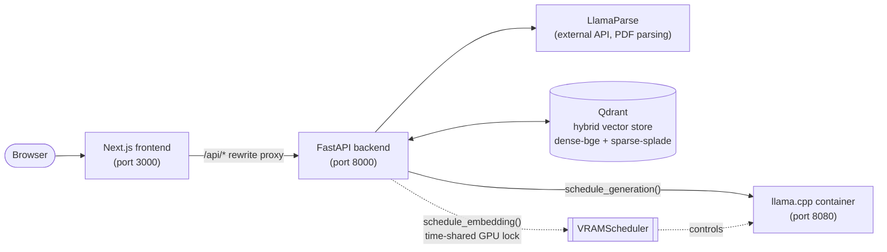

# RAG Project

**A self-hosted "NotebookLM": upload your PDFs, ask questions, get grounded answers —
running entirely on your own GPU, with nothing sent to a third-party LLM API.**

[](https://github.com/gerard-castell/rag-project/actions/workflows/ci.yml)
[](./LICENSE)
[](https://github.com/gerard-castell/rag-project/releases)
[](https://www.conventionalcommits.org)

Products like NotebookLM and ChatPDF solve "chat with your documents" by sending your
files to someone else's cloud. This project asks a narrower, harder question: **how
much of that can one consumer GPU do by itself** — hybrid dense+sparse retrieval, local
embeddings, and local generation — without giving up correctness or a usable UI?

The interesting engineering problem turned out not to be RAG itself, it was **fitting
it in 6GB of VRAM**: the embedding models and the LLM don't fit in memory together, so
the system needs to time-share the GPU between them (see
[`VRAMScheduler`](#gpu--vram-constraint-and-the-vramscheduler)) instead of just renting
a bigger box. That constraint, and the decisions it forced, are the part of this repo
worth reading.

**Stack:** FastAPI + Qdrant (hybrid dense/sparse vector search) + fastembed for
retrieval, a llama.cpp container for generation, Next.js for the UI, all orchestrated
with Docker Compose. See [Architecture](#architecture) below.

This is a staged, learning-driven build, not a one-shot dump — see
[What this project demonstrates](#what-this-project-demonstrates) and the
[roadmap](#roadmap) for how it got here and where it's going.

## Screenshots & demo

<!--
  TODO(#28): replace with real captures once the stack is running (`make up` or
  `make up-cpu`, frontend at http://localhost:3000). Suggested shots, saved into
  docs/screenshots/ and referenced below:
    1. docs/screenshots/upload.png   — drag-and-drop PDF upload + ingestion status
    2. docs/screenshots/chat.png     — a chat turn with retrieved-source citations shown
    3. docs/screenshots/demo.gif     — a short end-to-end loop: upload → ask → grounded answer
  Keep images under ~1MB each (PNG, cropped to the app viewport, no browser chrome).
-->

| Upload & ingest | Chat with citations |
| --- | --- |
| _screenshot pending — see `docs/screenshots/`_ | _screenshot pending — see `docs/screenshots/`_ |

## Hardware requirements

**By default this project requires an NVIDIA GPU.** `docker-compose.yml` reserves the
GPU device for the `llama-cpp` and `api` containers (NVIDIA drivers + the
[NVIDIA Container Toolkit](https://docs.nvidia.com/datacenter/cloud-native/container-toolkit/latest/install-guide.html)
must be installed on the host); `make up` checks for `nvidia-smi` first and fails fast
with a pointer to the CPU path below instead of a raw Docker device error.

**Minimum VRAM: ~6 GB** (an 8GB+ card gives more headroom). This is the size class the
`VRAMScheduler` was built around: the LLM (~4.6GB resident) and the embedding models
(~0.5–0.6GB each) don't fit in 6GB together, which is why generation and embedding are
strictly time-shared instead of run concurrently — see
[GPU / VRAM constraint](#gpu--vram-constraint-and-the-vramscheduler) below for the full
breakdown.

**No NVIDIA GPU?** Run the CPU-only path instead — slower, but functional, and good
enough for a portfolio demo:

```bash
make fetch-model
make up-cpu
```

`make up-cpu` uses [`docker-compose.cpu.yml`](./docker-compose.cpu.yml) to drop the GPU
device reservations and swap the `llama-cpp` image for its CPU-only build (`make
run-cpu` is the foreground equivalent). Everything else — endpoints, ingestion, hybrid
search — behaves the same; `LocalEmbedder` already falls back to CPU automatically
when CUDA isn't available (`backend/src/ingestion/embedder.py`), and `/health` reports
the detected device.

## Architecture



`VRAMScheduler` is the box in the middle of that GPU path: a single `asyncio.Lock`
means embedding generation and LLM generation never run concurrently on the one
available GPU — see [GPU / VRAM constraint](#gpu--vram-constraint-and-the-vramscheduler)
for why that's necessary and how it works.

<details>
<summary>ASCII version (renders without Mermaid support)</summary>

```
┌────────────┐      /api/*        ┌──────────────┐
│  Next.js   │ ─────────────────► │   FastAPI    │
│  frontend  │  (rewrite proxy)   │   backend    │
│ (port 3000)│                    │  (port 8000) │
└────────────┘                    └──────┬───────┘
                                          │
                    ┌─────────────────────┼─────────────────────┐
                    │                     │                     │
                    ▼                     ▼                     ▼
             ┌─────────────┐      ┌──────────────┐      ┌───────────────┐
             │   Qdrant    │      │  LlamaParse   │      │  llama.cpp    │
             │ (port 6333) │      │ (external API,│      │  container    │
             │ hybrid      │      │  PDF parsing) │      │ (port 8080)   │
             │ vector store│      └──────────────┘      │  gemma-4-E4B  │
             └─────────────┘                             └───────────────┘
                    ▲
                    │  dense (BAAI/bge-m3) + sparse (SPLADE) embeddings,
                    │  generated in-process by the FastAPI container
                    └────────────────── GPU ──────────────────┘
                         time-shared by VRAMScheduler
```

</details>

- **Ingest**: `POST /ingest` sanitizes the filename to a basename (no path traversal),
  verifies the content is actually a PDF (magic bytes) and within
  `MAX_UPLOAD_SIZE_BYTES`, saves it, then a background task parses it with LlamaParse,
  splits the text, generates dense (`BAAI/bge-m3`) and sparse
  (`prithivida/Splade_PP_en_v1`, SPLADE) embeddings locally via `fastembed` /
  `sentence-transformers`, and upserts everything into Qdrant as named vectors
  (`dense-bge`, `sparse-splade`).
- **Search**: `POST /search` embeds the query and runs a hybrid Qdrant query
  (`Prefetch` on both vectors + `FusionQuery(RRF)`).
- **Chat**: `POST /chat` runs the same hybrid search, stuffs the retrieved chunks into a
  context-only system prompt, and sends it to the llama.cpp container's
  `/completion` endpoint.
- **VRAM scheduler**: see [GPU / VRAM constraint](#gpu--vram-constraint-and-the-vramscheduler) below.

Note: `BAAI/bge-reranker-v2-m3` is present as a configured setting
(`rerank_model_name`) but is **not currently wired into the search or chat path** —
no reranking step runs today. Treat it as reserved/planned, not active.

## Quickstart

Requires Docker, Docker Compose, an NVIDIA GPU + drivers (see
[Hardware requirements](#hardware-requirements) above for the CPU-only alternative),
and a [LlamaParse API key](https://cloud.llamaindex.ai/).

```bash
git clone <this-repo>
cd rag-project

# 1. Download the LLM weights used by the llama.cpp container
make fetch-model

# 2. Set required env vars (see below), then build and start the full stack
make up
```

`make up` runs `docker compose up -d --build`, which starts four services: `qdrant`,
`llama-cpp`, `api`, and `frontend`.

- Frontend: http://localhost:3000
- API: http://localhost:8000 (docs at http://localhost:8000/docs)
- Qdrant: http://localhost:6333
- llama.cpp server: http://localhost:8080

Other useful targets: `make up-cpu` / `make run-cpu` (CPU-only, see
[Hardware requirements](#hardware-requirements)), `make down`, `make restart`,
`make logs` / `make logs-api` / `make logs-frontend`, `make status`,
`make clean` (also removes volumes), `make lint`, `make test`. For local (non-Docker)
dev: `make frontend-dev`, `make frontend-install`,
`cd backend && uv run uvicorn src.main:app --reload`.

## Environment variables

Copy [`backend/.env.example`](./backend/.env.example) to `backend/.env` and set
`LLAMA_PARSE_API_KEY` — every other setting has a working default. `.env.example`
documents the full list.

## Endpoint reference

Four endpoints — `GET /health`, `POST /ingest`, `POST /search`, `POST /chat`. See
[`docs/api.md`](./docs/api.md) for a written summary, or `/docs` (Swagger UI) for
full request/response schemas once the API is running.

## GPU / VRAM constraint (and the VRAMScheduler)

This project is built to run entirely on a single consumer GPU, which is not big
enough to keep the embedding models and the LLM resident in VRAM at the same time.
Rather than run everything simultaneously and risk an out-of-memory crash, the
`api` container includes a `VRAMScheduler` (`backend/src/core/vram_scheduler.py`) that
strictly time-shares the GPU:

- A single `asyncio.Lock` serializes all GPU work, so embedding generation and LLM
  generation never run concurrently.
- **Embedding models** (dense BGE + sparse SPLADE) are loaded/unloaded in-process
  around each use (`schedule_embedding`), releasing CUDA memory (`torch.cuda.empty_cache()`)
  when idle.
- **The LLM** runs in its own Docker container (`llama-cpp-gpu`, built from
  `ghcr.io/ggml-org/llama.cpp:full-cuda`). The scheduler controls its lifecycle
  directly through the Docker Engine API (the `api` container mounts
  `/var/run/docker.sock` for this), starting it on demand for `/chat`
  (`schedule_generation`, which polls the llama.cpp `/health` endpoint until ready)
  and stopping it automatically after `LLAMA_IDLE_TIMEOUT_SECONDS` (default 300s) of
  inactivity via a background idle watcher.
- This means the first chat request after a period of inactivity pays a container
  start + model load latency cost, in exchange for embedding and ingestion work
  never being starved of VRAM by an LLM sitting loaded but idle.

The project originally targeted an Ollama-based setup on a 6GB-class GPU, where the
combined footprint of the LLM (~4.6GB) plus the embedding and reranking models
(~0.5–0.6GB each) would have exceeded available VRAM if all were resident at once.
The LLM serving layer was later moved from Ollama to a llama.cpp container, but the
same underlying constraint — one GPU, more model memory than it can hold at once —
is why the scheduler exists.

## Security notes

**No authentication.** None of the endpoints (`/ingest`, `/search`, `/chat`,
`/documents`, `/health`) require credentials. This is fine for local, single-user use,
but **do not reverse-proxy or otherwise expose this API directly to the internet**
without putting an authenticating proxy (or equivalent access control) in front of it.

**No CORS policy is configured**, intentionally: the browser only ever talks to the
Next.js frontend, which proxies `/api/*` to the backend server-side (see
[`frontend/next.config.ts`](./frontend/next.config.ts)) — the browser never calls the
FastAPI backend directly. If you build a client that calls the API directly from a
browser, add an explicit `CORSMiddleware` allowlist rather than relying on this
default.

**Docker socket access.** `VRAMScheduler` needs to start/stop/inspect the
`llama-cpp-gpu` container from inside the `api` container. Mounting
`/var/run/docker.sock` straight into `api` would give that process root-equivalent
control of the entire host Docker daemon (create privileged containers, mount the host
filesystem, etc.) — too much blast radius for a service that's meant to be reachable
by anyone who can hit `/ingest` or `/chat`. Instead, `docker-compose.yml` puts a
[`tecnativa/docker-socket-proxy`](https://github.com/Tecnativa/docker-socket-proxy) in
front of the real socket: only the `docker-socket-proxy` container mounts
`/var/run/docker.sock` (read-only), and it's configured to allow just
`CONTAINERS` (inspect/list), `START`, and `STOP` — everything else (exec, images,
build, volumes, networks, ...) is denied. `api` talks to it over
`DOCKER_HOST=tcp://docker-socket-proxy:2375` on the internal compose network only; the
proxy publishes no host port. `docker.from_env()` in `VRAMScheduler` picks up
`DOCKER_HOST` automatically, so no application code changes were needed to adopt this.

**Upload limits.** `/ingest` sanitizes `file.filename` to a basename before it ever
touches the filesystem (rejects `../`-style path traversal), checks the file's magic
bytes to confirm it's actually a PDF before queuing it for parsing, and caps upload
size at `MAX_UPLOAD_SIZE_BYTES` (default 50MB, see `.env.example`) enforced while
streaming the upload to disk.

## Evaluation results

_Not yet available._ A RAGAS-based evaluation of retrieval and answer quality is
planned but not implemented in this repo yet — results will be added to this section
once that work lands.

## Release process

Releases are cut automatically by [semantic-release](https://semantic-release.gitbook.io/)
(configured in [`.releaserc.json`](./.releaserc.json), run by
[`.github/workflows/release.yml`](./.github/workflows/release.yml)) on every push to
`main` — there's no `CHANGELOG.md` to maintain by hand; the full history lives in the
repo's [Tags](../../tags) and [Releases](../../releases) pages.

Each merge to `main` is a single squash commit whose subject is the PR title, enforced
as a [Conventional Commit](https://www.conventionalcommits.org/) by
[`pr-title.yml`](./.github/workflows/pr-title.yml). semantic-release inspects every
commit subject since the last `vX.Y.Z` tag and picks the highest applicable bump:

- **`feat: ...`** → minor (`v0.1.0` → `v0.2.0`)
- **`fix: ...`** → patch (`v0.1.0` → `v0.1.1`)
- **`type!: ...`** (a `!` before the colon, on any commit type) → major
  (`v0.1.0` → `v1.0.0`)
- Anything else (`docs:`, `chore:`, `refactor:`, `perf:`, `test:`, `ci:`, `build:`) with
  no accompanying `feat`/`fix`/`!` commit in the range → no release.

When a release is warranted, semantic-release tags that commit and publishes a GitHub
Release with auto-generated notes grouped by commit type.

semantic-release always starts a project's very first release at `v1.0.0` and has no
built-in way to pick a different starting point — so the `v0.1.0` baseline ("phase-0
stabilized, boots and runs") is a one-time manual tag on `main`
(`git tag -a v0.1.0 -m v0.1.0 && git push origin v0.1.0`, plus a matching GitHub
Release). Every release after that is fully automatic.

## Development

```bash
cd backend
uv run uvicorn src.main:app --reload   # run the API locally (needs Qdrant/llama.cpp reachable)
uv run pytest                          # run tests
uv run ruff check . && uv run ruff format . && uv run mypy src/   # lint/type-check
```

See [`CLAUDE.md`](./CLAUDE.md) for a more detailed architecture/code-style guide aimed
at contributors and AI coding agents.

## What this project demonstrates

Beyond "it's a RAG app," the parts meant to show engineering judgment, not just
API-calling:

- **A real resource constraint, designed around instead of ignored.** One GPU can't
  hold the embedding models and the LLM at once — `VRAMScheduler` (see
  [GPU / VRAM constraint](#gpu--vram-constraint-and-the-vramscheduler)) makes that
  trade-off explicit and safe (time-sharing, not a random OOM) instead of just
  documenting "needs a bigger GPU."
- **Hybrid retrieval done properly**: dense (`BAAI/bge-m3`) + sparse (SPLADE) named
  vectors in Qdrant, fused with RRF via `Prefetch` + `FusionQuery` — not a single
  embedding model doing all the work.
- **Threat-modeled before going public**: filename sanitization against path
  traversal, magic-byte validation on uploads, upload size caps, a locked-down
  Docker-socket proxy instead of a raw `docker.sock` mount — see
  [Security notes](#security-notes).
- **A real release/CI discipline**: Conventional Commits enforced in CI, automated
  SemVer tagging via semantic-release, a CPU-only fallback path so the project is
  runnable without the author's exact hardware.
- **Staged, not a one-shot dump.** The [roadmap](#roadmap) below is the actual build
  order: get it working, close functional gaps, make it safe and presentable, then
  extend it (agentic self-correction, eval-driven development, observability).

## Roadmap

This repo is built in phases, tracked as GitHub issues/milestones rather than a single
upfront design doc — each phase's issues are linked below so the history is
inspectable, not just claimed.

- **Phase 0 — Stabilize.** Make the repo build, run, and test cleanly.
  ([`phase-0-stabilize`](https://github.com/gerard-castell/rag-project/issues?q=label%3Aphase-0-stabilize))
- **Phase 1 — Complete the core.** Ingestion status, document persistence, README/docs.
  ([`phase-1-complete`](https://github.com/gerard-castell/rag-project/issues?q=label%3Aphase-1-complete))
- **Phase 1.5 — Launch prep** (current). Security review, licensing, SemVer/releases,
  CPU fallback, code refactors, and this portfolio pass.
  ([`phase-1.5-launch-prep`](https://github.com/gerard-castell/rag-project/issues?q=label%3Aphase-1.5-launch-prep))
- **Phase 2 — Roadmap.** Markdown-aware chunking, a self-correcting LangGraph agent,
  RAGAS-based eval-driven development, streaming + semantic caching, Arize Phoenix
  observability.
  ([`phase-2-roadmap`](https://github.com/gerard-castell/rag-project/issues?q=label%3Aphase-2-roadmap))

See the full [issue tracker](https://github.com/gerard-castell/rag-project/issues) and
[milestones](https://github.com/gerard-castell/rag-project/milestones) for open work.
